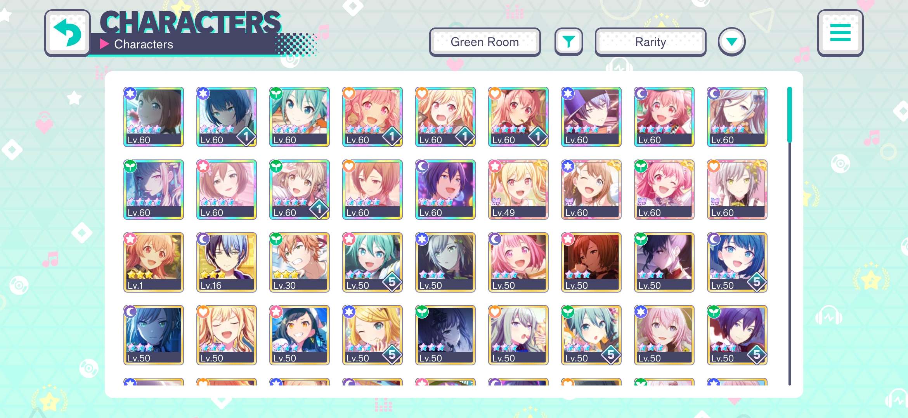
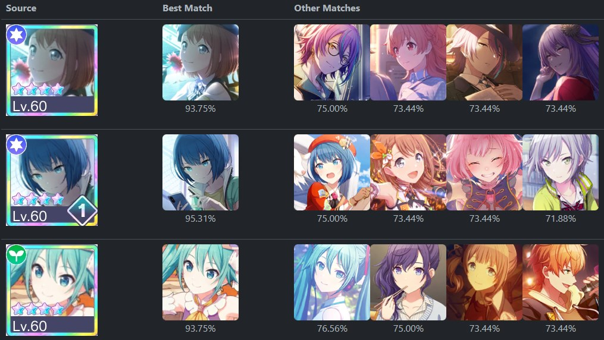

# Project Sekai - Thumbnail Matcher

A test app for extracting and matching Project Sekai card thumbnails.

This is a showcase of the approaches I found in [this repository](https://github.com/Ace4896/project-sekai-thumbnail-matching-notes):

- Using image contours to extract character thumbnails
- Using pHashes to identify and search for images

## Usage

[Link to Website Demo](https://ace4896.github.io/project-sekai-thumbnail-matcher/)

Upload a full, uncropped screenshot of your character list, e.g.:



If any card thumbnails can be located, the table will update to show potential matches for each one:



## Developer Usage

There are three projects in this repository:

- [`rust/lib`](./rust/lib): A Rust library for extracting and hashing thumbnail images
- [`rust/cli`](./rust/cli): A Rust CLI app for generating hashes from a folder of thumbnail images
- The website demo, which demonstrates how to use the backend library to match thumbnail images

To build the app, make sure you have:

- Stable Rust (tested on 1.74)
- NodeJS LTS (tested on 18.16.0)

The CLI app can be used as follows:

```bash
cd rust/cli

# Generate hashes from <thumbnail-folder>
# By default, the hashes are stored in a file "character_hashes.json"
# The output file can be changed using the --output flag
cargo run -- hash <thumbnail-folder> --output "./character_hashes.json"

# Extract thumbnail images from a character list screenshot
# By default, any extracted thumbnails are stored in a folder called "output"
# The output directory can be changed using the --output flag
# The thumbnails are named after the original screenshot: <file>-card-n.png
cargo run -- extract <file> --output "./output"
```

The website demo is managed using NodeJS and Vite. First, run `npm install` to install dependencies, then use one of the scripts below:

```bash
# Run app in development mode
npm run dev

# Build app in production mode
npm run build

# Preview app in production mode (requires building first)
npm run serve

# Build Rust library for WASM
# These scripts should be run automatically, but can be run manually if you need to rebuild
npm run build:wasm          # Debug build
npm run build:wasm-release  # Release build
```

The client-side code will use the pre-computed pHashes from [`public/character_hashes.json`](./public/character_hashes.json) to match the extracted thumbnails to those in [`public/thumbnails`](./public/thumbnails/).
